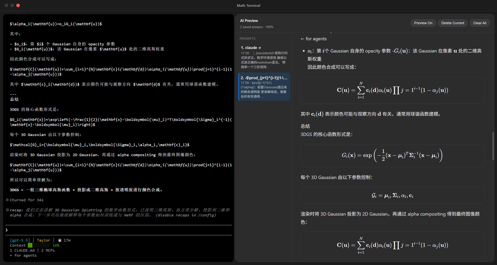
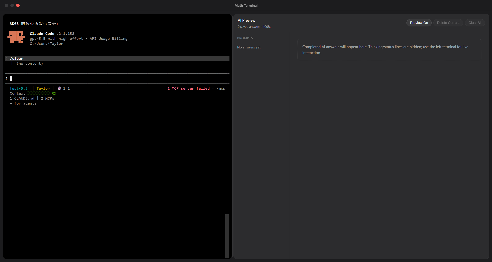

# Math Terminal

一个面向 AI 数学输出的跨平台桌面终端工具。它在左侧提供真实的本地终端交互，在右侧自动捕获 AI 回答，并将 Markdown、LaTeX 数学公式、本地图片等内容渲染成清晰的预览文档。

## 软件页面

### 页面截图





### 演示视频

<video src="./imgs/demo.mp4" controls width="100%"></video>

如果当前 Markdown 查看器不支持直接播放视频，可以点击这里查看：[demo.mp4](./imgs/demo.mp4)

## 项目简介

Math Terminal 主要解决在终端中使用 AI 工具时，回答内容不易阅读和整理的问题。普通终端适合交互，但对 Markdown、数学公式、长段落和图片的展示能力有限。本项目通过 Electron 内嵌终端，并增加 AI Preview 预览面板，让 AI 输出既能在终端中实时交互，也能在右侧以文档形式阅读。

它适用于：

- AI 编程与终端问答
- 数学公式推导与学习笔记
- Markdown 文档生成与预览
- Claude Code 等命令行 AI 工具的输出整理
- 长回答、代码块、公式和图片的结构化阅读

## 核心功能

### 内嵌本地终端

- 基于 `xterm.js` 提供终端界面。
- 基于 `node-pty` 启动本地 shell。
- 支持输入、输出、窗口尺寸同步和终端进程退出提示。

### AI 回答自动捕获

- 自动识别终端中的 AI 回答内容。
- 过滤命令提示符、终端 UI、状态行等干扰信息。
- 支持保存多条回答历史。
- 支持切换历史回答、删除当前回答和清空全部回答。

### Markdown 与 LaTeX 公式预览

- 使用 `markdown-it` 渲染 Markdown。
- 使用 `KaTeX` 渲染数学公式。
- 支持行内公式、块级公式、矩阵、`align`、`equation` 等常见数学环境。
- 自动修复部分 AI 输出中常见的公式换行、定界符和矩阵格式问题。

### 中文 AI 输出优化

- 优化中文句号后的段落分隔。
- 规范中文冒号后的列表格式。
- 改善中文数学说明、推导过程和长回答的阅读体验。

### 本地图片预览

- 支持 Markdown 图片语法：

  ```markdown
  
  ```

- 支持 `@image.png` 形式的本地图片引用。
- 通过 Electron 主进程解析本地图片路径，并在右侧预览中展示。

### 桌面端阅读体验

- 自定义无边框窗口。
- 支持最小化、最大化和关闭。
- 支持拖拽中间分隔条调整终端与预览区域宽度。
- 支持在预览区域使用 `Ctrl + 鼠标滚轮` 缩放内容。
- 支持双击终端区域快速跳转到当前预览回答。

## 技术栈

- Electron
- Electron Vite
- TypeScript
- xterm.js
- node-pty
- markdown-it
- KaTeX
- DOMPurify
- Vitest

## 安装与运行

### 1. 克隆项目

```bash
git clone https://github.com/你的用户名/math-terminal.git
cd math-terminal
```

如果你是直接下载源码压缩包，则解压后进入项目目录即可。

### 2. 安装依赖

```bash
npm install
```

### 3. 启动开发环境

```bash
npm run dev
```

启动后会打开 Math Terminal 桌面应用窗口。

## 使用教程

### 1. 打开应用

运行 `npm run dev` 后，应用会显示左右两栏界面：

- 左侧是本地终端。
- 右侧是 AI Preview 预览面板。

### 2. 在终端中运行 AI 工具

你可以在左侧终端中运行 Claude Code 或其他命令行 AI 工具，也可以像普通终端一样输入命令。

示例问题：

```text
请解释欧拉公式，并使用 LaTeX 展示关键公式。
```

也可以输入：

```text
生成一个包含标题、列表、代码块和数学公式的 Markdown 示例。
```

### 3. 查看右侧预览

当 AI 回答完成后，右侧 AI Preview 会自动捕获回答内容，并渲染为更易阅读的文档视图。

预览面板会自动处理：

- Markdown 标题
- 列表
- 代码块
- 行内数学公式
- 块级数学公式
- 矩阵和多行公式
- 中文段落
- 本地图片引用

### 4. 管理历史回答

右侧预览面板左边会显示已捕获的回答历史。

你可以：

- 点击历史条目切换不同回答。
- 点击 `Delete Current` 删除当前回答。
- 点击 `Clear All` 清空所有回答。

### 5. 调整界面布局

- 拖动中间分隔条，可以调整终端和预览区域的宽度。
- 在预览区域按住 `Ctrl` 并滚动鼠标滚轮，可以放大或缩小预览内容。
- 双击左侧终端区域，可以快速跳转到当前选中的预览回答。

### 6. 预览本地图片

如果 AI 输出或手动输入的 Markdown 中包含本地图片引用，例如：

```markdown

```

或：

```text
@app.png
```

应用会尝试解析该图片路径，并在右侧预览中显示图片。

## 常用命令

```bash
# 启动开发环境
npm run dev

# 类型检查
npm run typecheck

# 运行测试
npm run test

# 构建项目
npm run build

# 打包桌面应用
npm run dist
```

## 项目结构

```text
src/
  main/        Electron 主进程、终端进程管理和 IPC 注册
  preload/     安全暴露给渲染进程的 API
  renderer/    前端界面、终端视图、AI 预览、Markdown/数学公式渲染
  shared/      主进程、预加载脚本和渲染进程共享的类型定义
tests/
  unit/        单元测试
```

## 作品说明

Math Terminal 并不替代 AI 模型本身，而是作为命令行 AI 工具的桌面增强界面。它的核心价值在于把终端中的 AI 文本输出转化为更适合阅读、复盘和展示的结构化文档视图。

对于经常在终端中使用 AI 编程工具、生成数学推导、编写 Markdown 文档或查看长回答的用户，Math Terminal 可以显著提升输出内容的可读性和整理效率。

## 开源与第三方依赖说明

本项目使用了多个开源项目和 npm 依赖，包括 Electron、electron-vite、xterm.js、node-pty、markdown-it、KaTeX、DOMPurify、TypeScript、Vitest 等。

项目核心功能、界面逻辑、AI 输出捕获、Markdown/数学公式规范化和预览面板均为项目实现内容。

